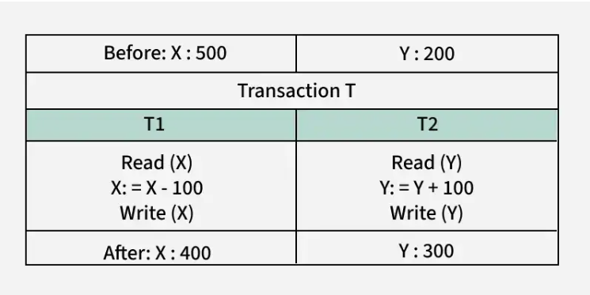
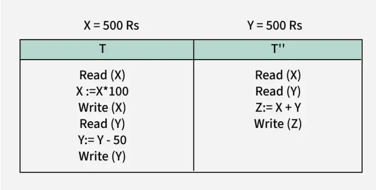

## ACID Properties
ACID properties in dbms means. 

**A** - Atomicity

**C** - Consistency

**I** - Isolation

**D** - Durability

These are properties that must be followed to ensure consistency in the databases ie Before and after a transaction. 

#### Atomicity:
This means that either the transaction takes place once or it does not take place at all.

 There is no midway i.e. transactions do not occur partially. Each transaction is considered as one unit and either runs to completion or is not executed at all.

  It involves the following two operations.

  1. **Abort :** If a transaction aborts, changes made to the database are not visible.

  2. **Commit :** If a transaction commits, changes made are visible.

It is also known as the all or nothing rule.

Lets consider the example below.

Consider the following transaction `T` consisting of `T1` and `T2` : Transfer of `100` from account `X` to account `Y` .

If the transaction fails after completion of `T1` but before completion of `T2` ( say, after write`(X)` but before write`(Y)` ), then the amount has been deducted from` X` but not added to `Y` . This results in an inconsistent database state. Therefore, the transaction must be executed in its entirety in order to ensure the correctness of the database state.

#### Consistency: 
This means that the databse has to be consistent before and after the transaction.

It guarantees that any transaction will take the database from one consistent state to another, maintaining the rules and constraints defined for the data

Referring to the example above,

The total amount before and after the transaction must be maintained.
Total before `T` occurs = 500 + 200 = 700 .
Total after` T` occurs = 400 + 300 = 700 .

Therefore, the database is consistent . Inconsistency occurs in case T1 completes but T2 fails.

#### Isolation:
This means multiple transaction can occur independently without interference.

Transactions occur independently without interference. Changes occurring in a particular transaction will not be visible to any other transaction until that particular change in that transaction is written to memory or has been committed. This property ensures that when multiple transactions run at the same time, the result will be the same as if they were run one after another in a specific order.
Let X = 500, Y = 500.

Consider two transactions T and T”.

Suppose` T` has been executed till Read `(Y)` and then` T’’` starts. As a result, interleaving of operations takes place due to which `T’’` reads the correct value of `X` but the incorrect value of` Y` and sum computed by
`T’’: (X+Y = 50, 000+500=50, 500)` .

is thus not consistent with the sum at end of the transaction:
`T: (X+Y = 50, 000 + 450 = 50, 450) `.

This results in database inconsistency, due to a loss of 50 units. Hence, transactions must take place in isolation and changes should be visible only after they have been made to the main memory.

#### Durability:
This means that the changes of a succesful transaction occurs even if there is a system failure.

The updates and modifications to the database are stored in and written to a disk and they persist even if a system failure occurs. These updates now become permanent and are stored in non-volatile memory. The effects of the transaction, thus, are never lost.

In the table below are some important points to note.

| Property    | Responsibility for maintaining properties     |
|------------|---------------------------------------------|
| Atomicity  | Transaction Manager                        |
| Consistency | Application programmer                    |
| Isolation  | Concurrency Control Manager               |
| Durability | Recovery Manager                          |

