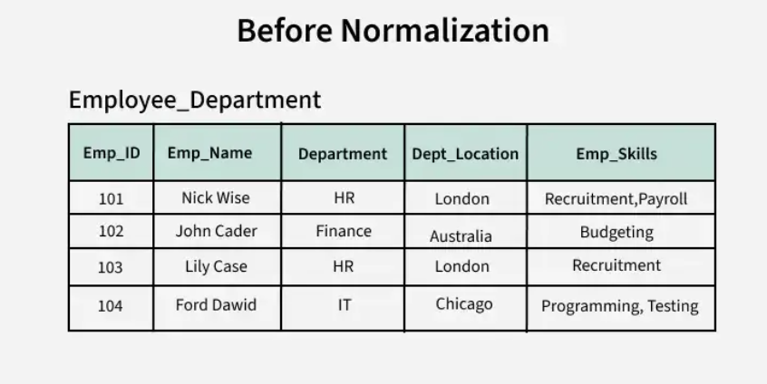
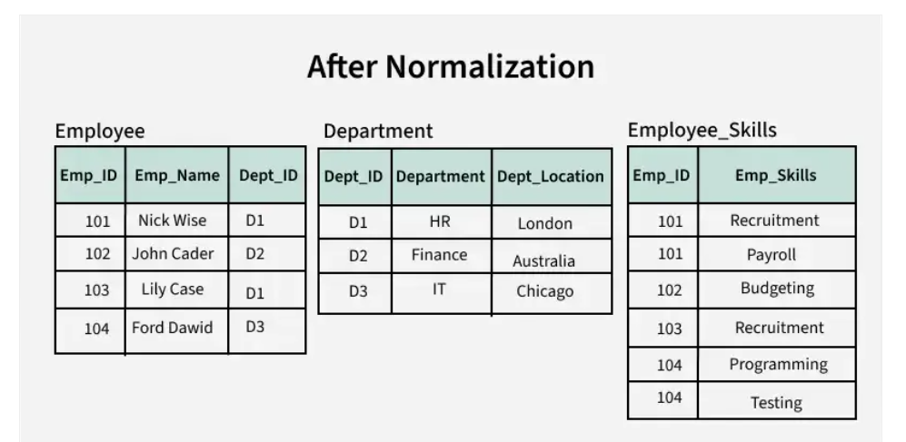

## Database Normalization
**Database normalization** is the process of organizing the attributes of the database to reduce or eliminate data redundancy (having the same data but at different places).
It is an important process in database design that helps improve the database’s efficiency, consistency, and accuracy.

Data redundancy unnecessarily increases the size of the database as the same data is repeated in many places and this may lead to inconsistensy problems which arise during insert, delete, and update operations.

Normalization generally involves splitting a table into multiple ones which must be linked each time a query is made requiring data from the split tables.

### Why Database Normalization is Important
The primary objective for normalizing the relations is to eliminate the below anomalies.

1. **Insertion Anomalies:** These occurs when it is not possible to insert data into a database because the required fields are missing or the data is incomplete.

Exapmle- if a database requires that every record has a primary key but no value is provided for a particular record, it cannot be inserted into the database.

2. **Deletion anomalies:** Deletion anomalies occur when deleting a record from a database and can result in the unintentional loss of data.

Example-  if a database contains information about customers and orders, deleting a customer record may also delete all the orders associated with that customer.

3. **Updating anomalies:** These occur when modifying data in a database and can result in inconsistencies or errors.

Example- if a database contains information about employees and their salaries, updating an employee’s salary in one record but not in all related records could lead to incorrect calculations and reporting.

Here is an illustration of how a datbase looks like before normalization.

As you can see from the table, this data is prone to anomalies and redundancy.

We can perform a database normalization on this table by creating 2 more tables and sort it using the employee name, the department and by the employees skills. 

This will enable us to have a clean database by using the employee id as the main identifier. 

Below is an exapmle of this table after a database normalization.

